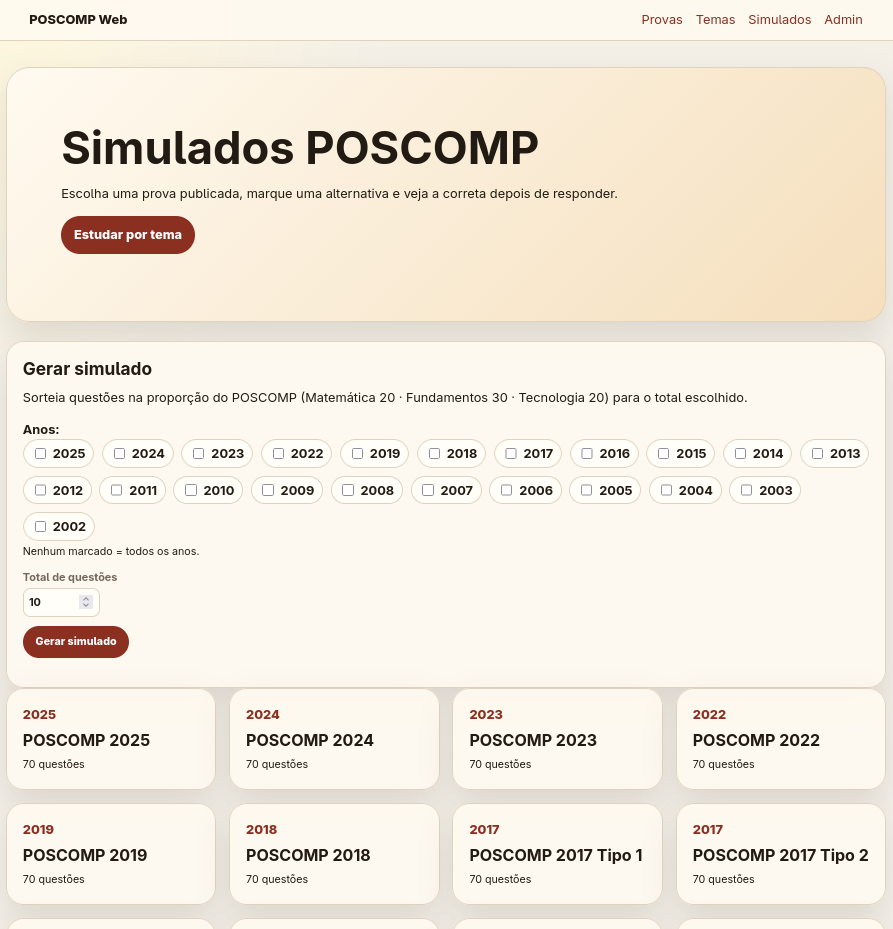
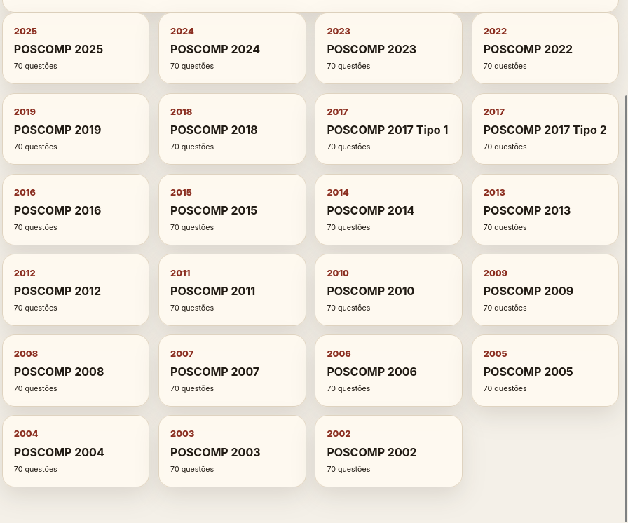
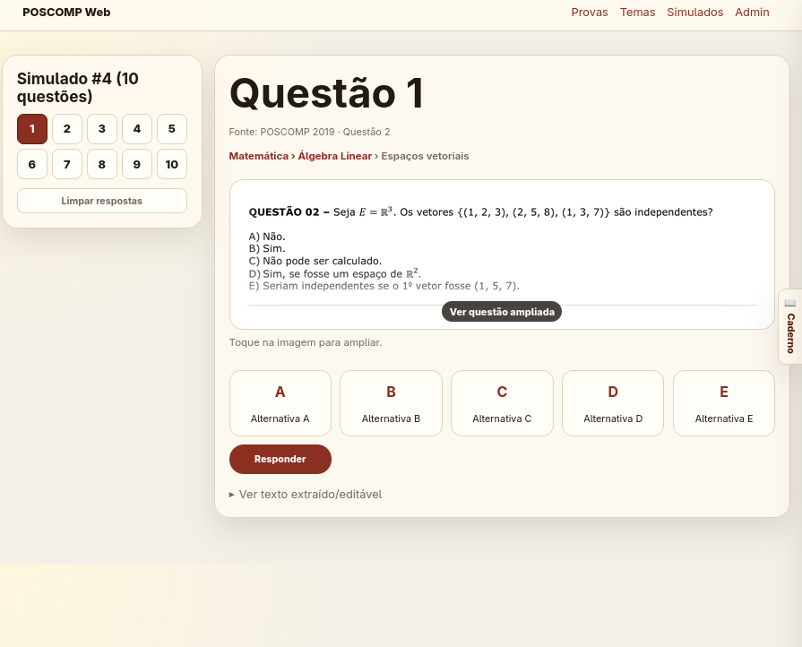
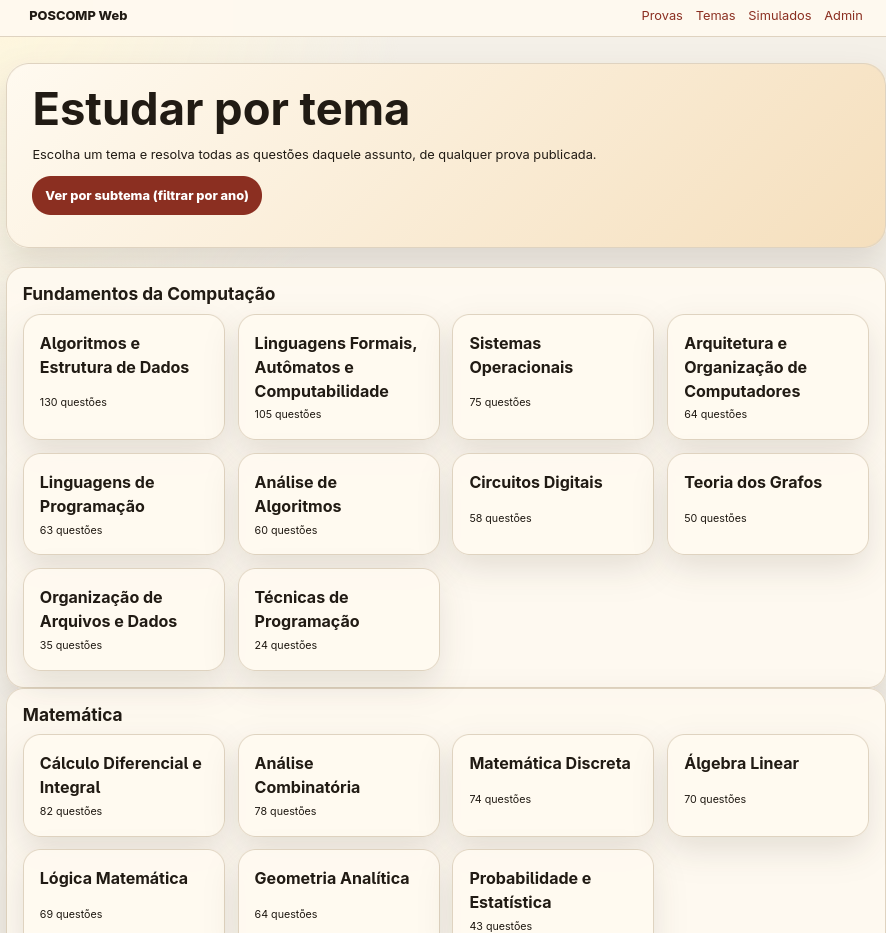
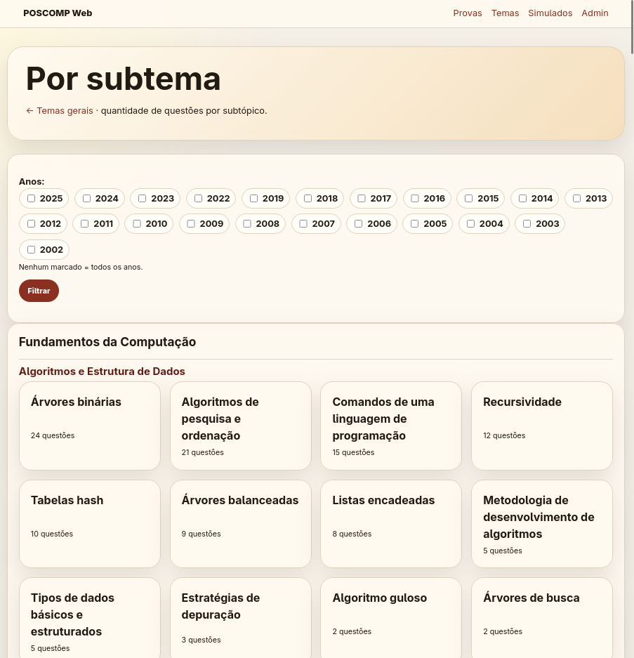
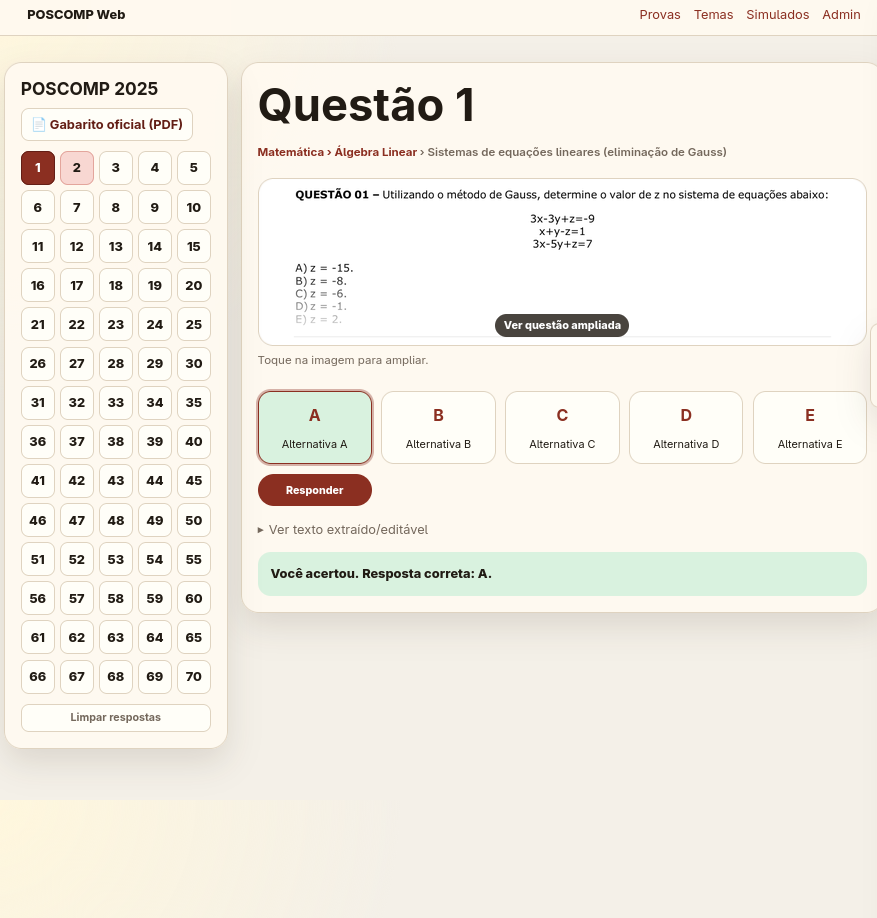
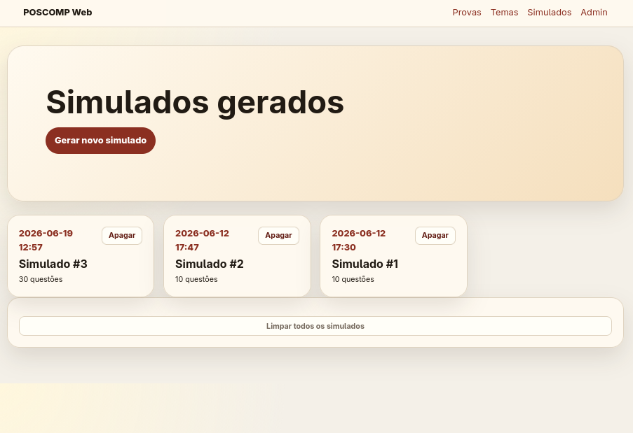
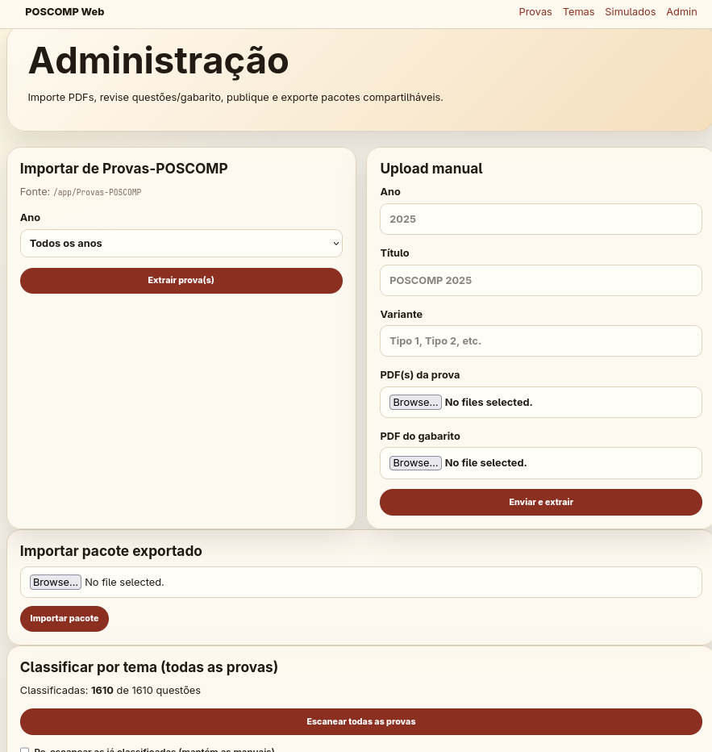

# POSCOMP Web

App web local para importar PDFs de provas/gabaritos POSCOMP, revisar questões e publicar simulados.

## Rodar

```bash
uv sync
uv run uvicorn poscomp_app.main:app --reload
```

Abra `http://127.0.0.1:8000/admin` para importar e revisar provas.

## Telas

### Provas e simulados
Todas as provas POSCOMP publicadas (2002–2025), com as variantes Tipo 1/Tipo 2
de 2017. Cada prova tem 70 questões.




### Gerar simulado
Sorteia questões na proporção oficial do POSCOMP (Matemática 20 · Fundamentos 30
· Tecnologia 20). Dá pra filtrar por ano e escolher o total de questões. Sem ano
marcado = todos os anos. O simulado gerado vira uma trilha própria de questões
(cada questão mostra de qual prova/ano veio).



### Estudar por tema
Agrupa questões de todas as provas por área e tema (Fundamentos, Matemática,
Tecnologia…), com a contagem de questões em cada um. Ótimo pra treinar um assunto
específico.



### Estudar por subtema
Detalha cada tema em subtópicos (árvores binárias, recursividade, tabelas hash…)
e permite filtrar por ano.



### Responder questões
Enunciado renderizado como imagem (recorte do PDF), então fórmulas e figuras
aparecem exatas. Marca a alternativa, responde e vê a correta na hora. A trilha
Área › Tema › Subtópico aparece no topo.



### Simulados gerados
Lista dos simulados criados, com data e quantidade de questões. Dá pra refazer
ou apagar.



### Admin
Importa PDFs da pasta `Provas-POSCOMP` ou por upload manual, revisa
questões/gabarito, classifica por tema e exporta/importa pacotes.



## Fluxo

1. Importe um ano da pasta `Provas-POSCOMP` ou envie PDFs manualmente.
2. Revise questões e gabarito no admin.
3. Classifique por tema (opcional) — ver abaixo.
4. Publique a prova.
5. Use a tela pública para responder ou navegar por tema em `/temas`.
6. Exporte/importe pacotes `.zip` com JSON e imagens.

## Classificação por tema (Ollama)

Cada questão pode receber Área → Tema → Subtópico da taxonomia oficial
(`poscomp_app/taxonomy.json`) via um modelo no Ollama. A questão é enviada como
texto **+ imagem** (recorte do PDF), então o modelo multimodal lê fórmulas e
figuras direto da imagem.

Configure o servidor Ollama num `.env` (veja `.env.example`):

```env
OLLAMA_HOST=http://localhost:11434
OLLAMA_MODEL=gemma4:12b
OLLAMA_TIMEOUT=180
```

- **Por prova:** botão "Classificar automaticamente" em `/admin/exams/{id}`.
- **Todas as provas:** botão "Escanear todas as provas" em `/admin`.
- **Por questão / correção manual:** na tela de edição da questão.

A classificação roda em segundo plano no servidor, processa uma questão de cada
vez e salva cada resultado na hora. Fechar o navegador não interrompe; se o
servidor cair, clicar de novo retoma de onde parou (só processa questões sem tema).

## Créditos

Os PDFs de provas e gabaritos em `Provas-POSCOMP/` vêm do repositório
[amimaro/Provas-POSCOMP](https://github.com/amimaro/Provas-POSCOMP), que compilou
todas as provas e gabaritos do POSCOMP. Este projeto só foi possível graças a esse
trabalho de coleta. Obrigado!
